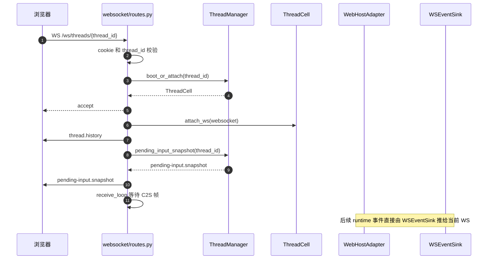
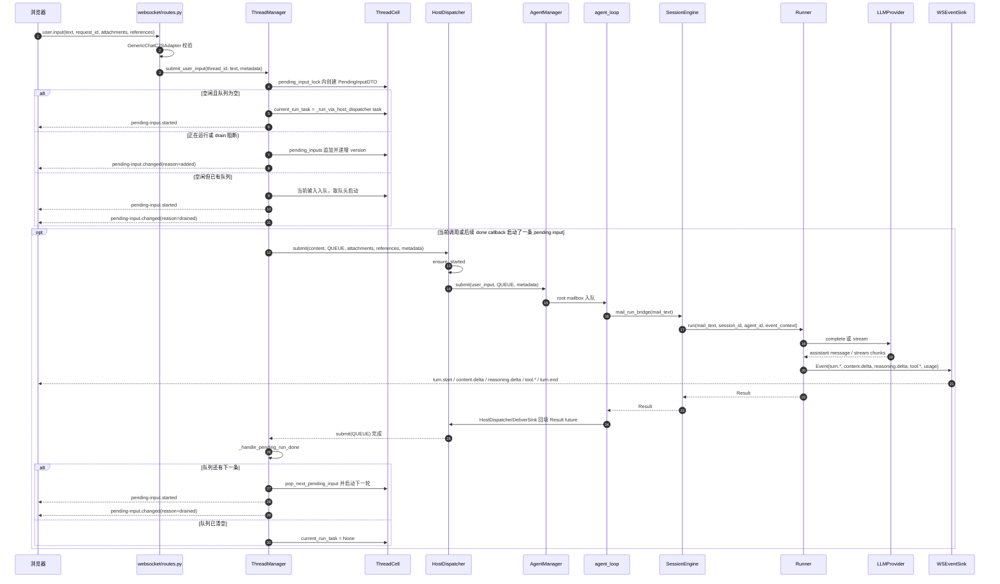
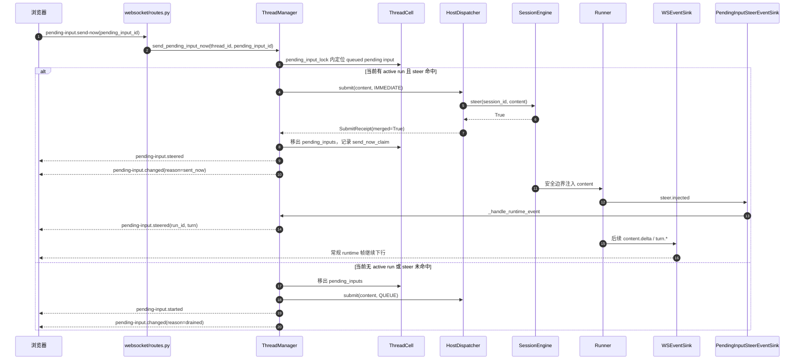
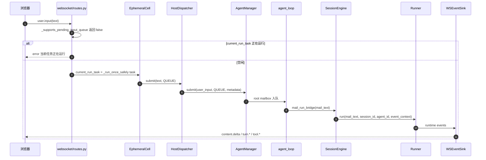

# Web 消息收发时序图

本页描述 `generic_chat` 当前主链路。浏览器入帧先到 `websocket/routes.py`，普通输入进入 `ThreadManager` 的 pending input 状态机，实际运行统一通过 `HostDispatcher.submit(text, mode)` 投递 root agent mailbox。下行内容由 `WSEventSink` 把 `Runner` 事件转换成 WS 帧。

## 连接和补偿下行

WebSocket 建连后先补历史和 pending input 队列快照，再进入持续收帧循环。断线重连时，前端用这两类帧校准历史消息和后端队列真源。

## 普通发送和排队

`user.input` / `choice.submit` 的生产路径都进入 `ThreadManager._submit_pending_input`。当前 thread 空闲且队列为空时直接启动 run；当前 run 占用执行权、drain 被阻断或已有队列时写入 `pending_inputs`，再通过 `pending-input.changed` 把完整快照广播给前端。

## 插队 send-now

前端只能对尚未启动的 pending input 发 `pending-input.send-now`。active run 存在时，后端校验该 pending input 只含可安全插入的纯文本参数，然后通过 `HostDispatcher.submit(IMMEDIATE)` 调用 `runtime.steer`；命中插入后移出队列并广播 `pending-input.steered`。没有可插入 run 时，该项会从队列移出并启动成普通 QUEUE run。

## 临时 cell 旁路

少数无 `pending_input_lock` 的 ephemeral cell 仍由 `routes.py` 启动 `_start_run_once_task`。该旁路没有 pending input 队列；运行中收到新 `user.input` 会返回错误帧。它的执行入口仍是 `cell.host_dispatcher.submit(QUEUE)`。

## 接收侧边界

- 历史补偿：建连时 `thread.history` 从 session 历史生成；`pending-input.snapshot` 从 `ThreadCell.pending_inputs` 生成。
- 实时内容：`Runner` 发 `content.delta` / `reasoning.delta` / `turn.*` / `tool.*` / usage 事件，`WSEventSink` 转成协议帧。
- 最终兜底：`WebHostAdapter.render_result` 对正常结果 no-op；错误结果补一条 assistant final，避免浏览器漏显错误。
