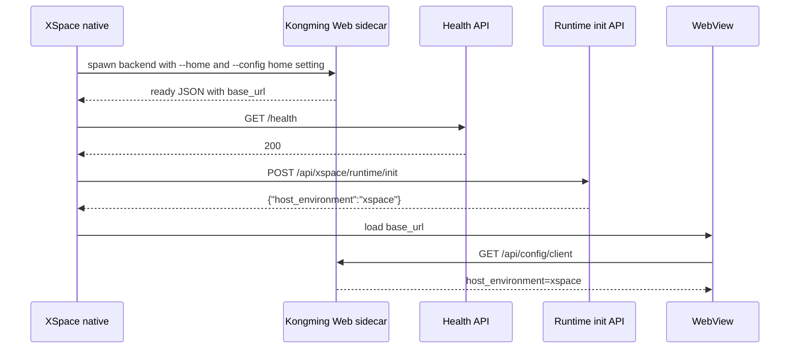

# XSpace Runtime Init

XSpace native 宿主在 Kongming Web sidecar 启动完成后调用 runtime init，把当前后端进程标记为 `xspace` 宿主。这个接口只改内存态，不写入 `setting.yaml`。

## 调用时机

固定顺序：

1. XSpace 准备 `<app_data>/kongming/setting.yaml`。首次启动从 `<resource>/kongming/config/setting.yaml` 复制；后续启动保留用户已有配置。
2. XSpace spawn `kongming-web-backend.exe`，`--config` 指向 `<app_data>/kongming/setting.yaml`。
3. XSpace 读取 stdout ready JSON，或轮询 `/health` 得到 200。
4. XSpace 调用 `POST /api/xspace/runtime/init`。
5. init 返回 200 后，XSpace 再加载 WebView `base_url`。

后端进程每次重启都要重新调用一次 init。该状态只存在于当前 Web sidecar 进程内。

## 启动命令

```powershell
kongming-web-backend.exe `
  --host 127.0.0.1 `
  --port 0 `
  --home <app_data>\kongming `
  --config <app_data>\kongming\setting.yaml `
  --dist-dir <resource>\kongming\web\dist `
  --print-ready-json
```

`--host-environment xspace` 仍可作为调试覆盖入口。XSpace 常规集成使用 runtime init。

## Init API

```http
POST /api/xspace/runtime/init
X-Requested-With: XMLHttpRequest
Content-Type: application/json

{}
```

也可以显式传入：

```json
{
  "host_environment": "xspace"
}
```

成功响应：

```json
{
  "host_environment": "xspace",
  "config_client_path": "/api/config/client"
}
```

该接口启动期免登录。它仍要求 `X-Requested-With: XMLHttpRequest`，用于挡掉普通网页的跨站表单请求。

## TypeScript 调用函数

```ts
export async function initKongmingXSpaceRuntime(baseUrl: string): Promise<void> {
  const response = await fetch(`${baseUrl}/api/xspace/runtime/init`, {
    method: "POST",
    headers: {
      "Content-Type": "application/json",
      "X-Requested-With": "XMLHttpRequest",
    },
    body: JSON.stringify({ host_environment: "xspace" }),
  });

  if (!response.ok) {
    const text = await response.text();
    throw new Error(`Kongming XSpace runtime init failed: ${response.status} ${text}`);
  }
}
```

调用位置：拿到 ready JSON 的 `base_url` 并确认 `/health` 为 200 后，加载 WebView 前。

## Rust reqwest 调用函数

```rust
pub async fn init_kongming_xspace_runtime(base_url: &str) -> anyhow::Result<()> {
    let client = reqwest::Client::new();
    let url = format!("{}/api/xspace/runtime/init", base_url.trim_end_matches('/'));
    let response = client
        .post(url)
        .header("X-Requested-With", "XMLHttpRequest")
        .json(&serde_json::json!({ "host_environment": "xspace" }))
        .send()
        .await?;

    if !response.status().is_success() {
        let status = response.status();
        let body = response.text().await.unwrap_or_default();
        anyhow::bail!("Kongming XSpace runtime init failed: {status} {body}");
    }

    Ok(())
}
```

## 时序图



## 边界

- init 只更新当前进程内的 `app.state.config.web.host_environment` 和 `KONGMING_WEB_HOST_ENVIRONMENT`。
- init 不迁移、不写入、不覆盖 `setting.yaml`。
- provider、API key、端口、路径等持久配置必须在 sidecar spawn 前由 `<app_data>/kongming/setting.yaml` 决定。
- init 可以重复调用，返回 200 即表示当前进程已进入 XSpace 宿主态。

## 2026-06-17 Codex 修正说明

本节由 Codex 根据 XSpace debug 构建和实测启动结果追加，用于校正本文示例与当前 XSpace 实现之间的差异。

当前 XSpace 的实际运行态目录是用户 home 下的 `.kongming`：

```text
--home /Users/kid/.kongming
--config /Users/kid/.kongming/setting.yaml
```

当前 XSpace 的端口策略是先由 XSpace native 预留端口，再把具体端口传给 Kongming sidecar。移动配对可用时，XSpace 同时传入同端口的 `--server-origin`：

```text
kongming-web-backend
  --host 0.0.0.0
  --port 54340
  --home /Users/kid/.kongming
  --config /Users/kid/.kongming/setting.yaml
  --dist-dir /Volumes/machub_app/proj/XSpace/client/src-tauri/resources/kongming/web/dist
  --print-ready-json
  --server-origin http://10.1.10.55:54340
```

XSpace 侧已在 `client/src-tauri/src/kongming_sidecar.rs` 中接入 runtime init。当前启动顺序是：

```text
spawn Kongming sidecar
read ready JSON
validate ready payload
GET /health
POST /api/xspace/runtime/init {"host_environment":"xspace"}
return ready URL to InstanceStore and WebView
```

实测 trace：

```text
kongming_sidecar:runtime_init_start url=http://127.0.0.1:54340/api/xspace/runtime/init
kongming_sidecar:runtime_init_ready status=200
kongming_sidecar:ready url=Some("http://127.0.0.1:54340")
ui:bootstrap payload ... "warning_count":0
```

Kongming 侧源码已经包含 `POST /api/xspace/runtime/init` 路由、启动期免登录白名单和配置客户端测试。XSpace 打包资源中的 `kongming-web-backend` 需要来自包含该路由的新版 Kongming 构建产物。
