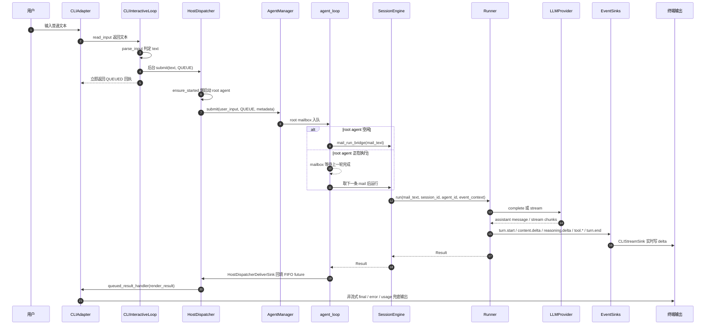
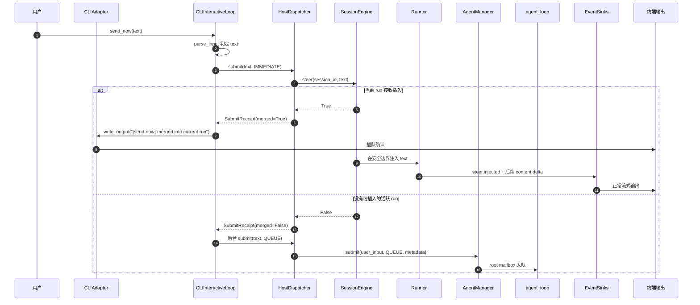

# CLI 消息收发时序图

本页描述当前 CLI 普通文本链路。命令输入走 `CommandService.handle_command` 控制面，普通文本统一通过 `HostDispatcher.submit(text, mode)` 投递 root agent mailbox。

## 普通发送和排队

`CLIInteractiveLoop.send()` 对普通文本创建后台 submit task 并立即回到 REPL。`SubmitMode.QUEUE` 在 `HostDispatcher` 内等待本轮 `Result`，但等待发生在后台 task 里；用户侧可以继续输入。agent 忙时，`AgentManager` 的 root mailbox 保持 FIFO，上一轮结束后继续处理下一条。

## 显式插队 send-now

`CLIInteractiveLoop.send_now()` 对普通文本先尝试 `SubmitMode.IMMEDIATE`。命中活跃 run 时，文本进入 `runtime.steer` 的插入缓冲；未命中时，CLI 创建普通 QUEUE submit task，回到上一节流程。

## 接收侧边界

- 实时文本：`Runner` 通过 `content.delta` / `reasoning.delta` 事件写入 `CLIStreamSink`，终端边生成边显示。
- 最终结果：`HostDispatcherDeliverSink` 只回填等待中的 `Result` future；`CLIAdapter.render_result` 负责非流式 final、错误和用量兜底输出。
- 命令输入：slash command 由 `CommandService.handle_command` 处理；普通文本链路不经过命令服务。
