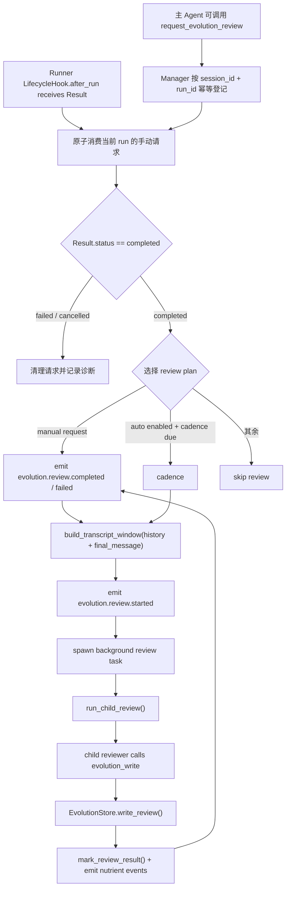
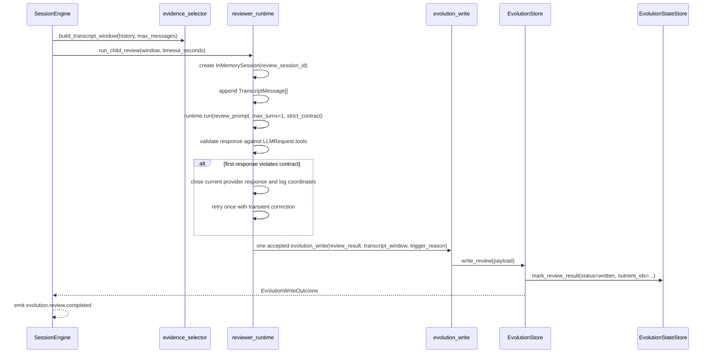
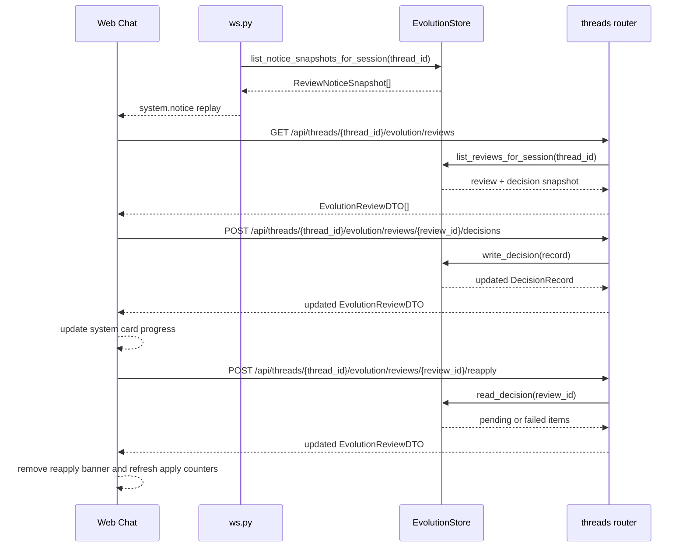
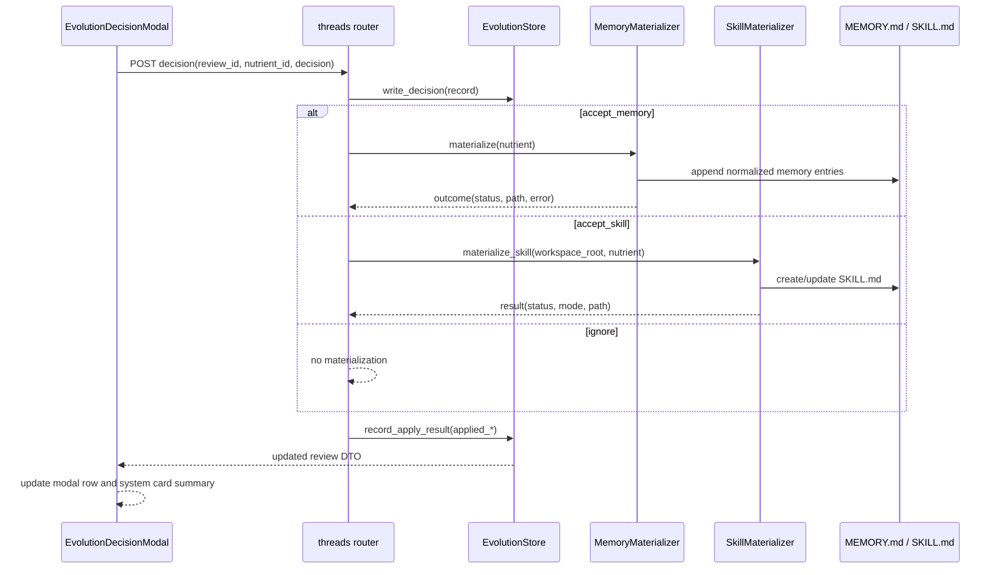
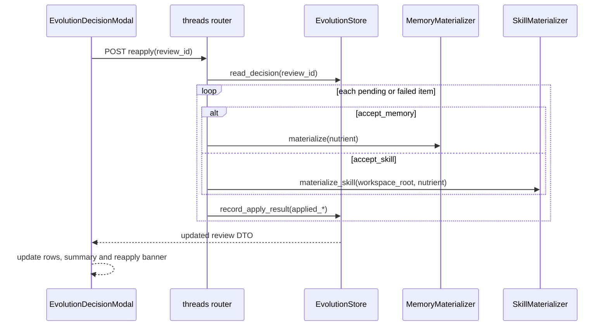
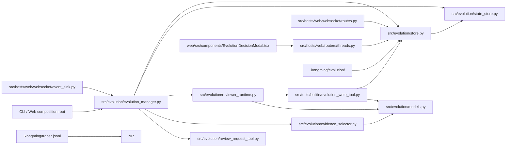

# src/evolution/ — 自我进化

主对话结束后的后台复盘层：支持 cadence 自动触发、主 Agent 显式调用 `request_evolution_review` 和 Web `/evolve` 控制命令，统一裁剪终态证据窗口、fork child reviewer，再通过私有 `evolution_write` 把 review record 和进化养料写进 `.kongming/evolution/`。

## 设计理念

| 决策 | 理由 |
|------|------|
| `src/evolution/` 只承接复盘域模型、证据裁剪、reviewer runtime、状态与落盘 | 主链 run loop 继续留在 `core.Runner` 和 `SessionEngine`，进化层只负责“复盘这一件事” |
| child reviewer 走独立 session + 独立 `AgentSpec` + 单工具白名单 | 复盘上下文、主会话历史、普通工具面三者隔离，reviewer 只允许调用 `evolution_write` |
| child reviewer 显式启用 `DECLARED_EXACTLY_ONCE` 工具合同 | 每条被接受的 reviewer 响应恰好调用一次 `evolution_write`；未声明工具、第二次调用和零调用会原子拒绝整条响应，并使用干净历史纠错一次 |
| reviewer provider 响应由 child Runner 本地管理 | 流式违规出现时关闭当前 reviewer LLM 请求的响应迭代器；纠错提示只进入同一 reviewer run 的下一次 LLM 请求，主 thread 生命周期保持独立 |
| 审批边界显式声明为 `EvolutionApprovalMode.RESTRICTED_BYPASS` | `RestrictedBypassApproval` 只在由 `build_restricted_reviewer_registry()` 构造的单工具 registry 内生效；任意第二工具无法进入 reviewer 工具面。 |
| `.kongming/evolution/` 分成 `reviews/`、`evolution-nutrients.jsonl`、`decisions/`、`apply-jobs/`、`evolution.state.json` 五层 | 单次 review 原始记录、长期候选内容、用户决策结果、apply 恢复队列、控制状态各自独立，便于回放、去重、断因 |
| `evolution_write` 是唯一写入口 | review record、nutrient queue、状态更新、`evolution.nutrient_written` 事件都经同一入口，避免出现多条旁路写脏数据 |
| 公开请求与私有写入分成两级 Tool | 主 Agent 只启用 `request_evolution_review`；child reviewer 的 restricted registry 只含 `evolution_write` |
| 显式请求采用“run 内登记、after-run 消费” | ToolContext 提供当前 `session_id/run_id`；Manager 等最终回答产生后再构建完整证据窗口 |
| Web `/evolve` 采用控制面直达 | WebSocket 在普通输入投递前消费命令；Manager 从当前 Session 构造窗口并直接启动 child reviewer |
| `EvolutionManager` 是请求状态与 Tool 注册的唯一 owner | 幂等键固定为 `(session_id, run_id)`；CLI/Web 通过 Manager 注册和过滤工具 |
| cadence 按主 run 次数推进 | 触发节奏只跟主链 `completed run` 有关，reviewer 成败不回滚计数，时序稳定、可预测 |
| review 结果优先写 `evo` 目录，不直接写 memory | 第一版先沉淀候选资产，保留人工筛选和后续 promote 空间 |

## 核心概念

### 1. `TranscriptWindow`

child reviewer 接收到的不是整条 session 历史，而是最近一段裁剪后的证据窗口：

- `session_id` / `run_id`
- `included_turns`
- `messages`
- `final_message`
- `tool_call_count`
- `summary`

当前裁剪策略按 `max_history_messages` 截最近 N 条消息，并把 tool 结果压成文本摘要。

### 2. `ReviewResult`

child reviewer 最终交给 `evolution_write` 的结构化结果：

- `run_id`
- `session_id`
- `reviewed_at_ms`
- `review_summary`
- `nutrients[]`
- `skip_reasons[]`

### 3. `EvolutionNutrient`

进化养料是 v0.1.9 的核心内容单元：

- `kind`: `memory | workflow | error`
- `title`
- `content`
- `summary`
- `confidence`
- `evidence_turns`
- `source_run_id`
- `source_session_id`
- `suggested_target`
- `tags`

当前版本已经支持用户决策后的立即 materialize：

- `accept_memory` 立即写 `<kongming_home>/memory/MEMORY.md`
- `accept_skill` 立即写 `<thread.cwd>/.kongming/skills/<skill-name>/SKILL.md`，作为 workspace skill 覆盖源
- `ignore` 只记录 decision

### 4. `SessionLearningState`

每个 session 的 cadence 与最近一次 review 状态：

- `run_count`
- `user_turn_count`
- `last_reviewed_run_id`
- `last_review_at_ms`
- `last_nutrient_id`
- `last_nutrient_at_ms`
- `last_review_status`

### 5. `ManualReviewRequest` 与 `EvolutionReviewPlan`

`request_evolution_review` 将当前 run 的显式意图登记为冻结 `ManualReviewRequest`：

- `session_id` / `run_id`
- `focus: str | None`
- `requested_at_ms`

Manager 以 `(session_id, run_id)` 加锁幂等，第一次 focus 保持不变。对应 run 进入终态后原子消费请求：`completed` 生成 `EvolutionReviewPlan(trigger=manual_tool)`；`failed/cancelled` 清理请求并记录诊断。手动计划跳过 `min_user_turns` 和 `every_n_runs`；手动与 cadence 同时命中时只启动一次 reviewer。

Web `/evolve` 走即时控制命令路径。`hosts.web.websocket.routes` 在
`ThreadManager.submit_user_input` 前识别命令，通过
`SessionEngine.get_or_create_session(thread_id)` 取得当前历史，再调用
`EvolutionManager.start_manual_command_review(...)`。Manager 为每次命令生成独立
`run-manual-command-*` id、构造 `TranscriptWindow`，并复用 `_start_review_task()`
启动 child reviewer。路由消费控制命令后依据 `cell.current_run_task` 投影主 run：
空闲时通过 Pydantic `ThreadStatusFrame` 广播 `idle`，活跃时保留当前运行态；
后台复盘进度继续由 `evolution.review.*` 卡片展示。命令文本留在控制面，主 session
保持原有消息记录。Slash catalog 只对 `backend_kind=generic_chat` 的现有 thread
展示该命令，空线程、Claude Code 和 Codex Composer 保持隐藏。

### 6. `DecisionRecord`

用户在 web 聊天界面里逐条处理进化养料后，会把结果单独写成 decision record：

- `review_id`
- `session_id`
- `run_id`
- `summary`
- `items[]`

其中 `items[]` 是逐条决策与 apply 审计：

- `nutrient_id`
- `decision`: `accept_memory | accept_skill | ignore`
- `target`: `memory | skill | null`
- `decided_at_ms`
- `applied_status`: `pending | written | skipped | failed`
- `applied_path`
- `applied_mode`: `append | update | create | ignore`
- `applied_at_ms`
- `applied_error`

## `.kongming/evolution/` 目录产物

| 路径 | 内容层级 | 代表什么 | 什么时候写 |
|------|----------|----------|------------|
| `.kongming/evolution/evolution.state.json` | 控制层 | 每个 session 的 run 计数、最近一次 review 状态、最近一次 nutrient 锚点 | 主 run 结束后先更新 `run_count`；review 完成或失败后更新最终状态 |
| `.kongming/evolution/evolution-nutrients.jsonl` | 内容层 | 所有已写入的进化养料队列，一行一条 JSON | `evolution_write` 成功写 review 后追加 |
| `.kongming/evolution/reviews/<run_id>.json` | 单次记录层 | 某一轮 review 的原始归档，含 `review_summary`、`nutrients`、`skip_reasons`、窗口摘要 | `evolution_write` 成功时原子写入 |
| `.kongming/evolution/decisions/<review_id>.json` | 决策层 | 某一轮 review 的用户决策结果，含逐条 `accept_memory / accept_skill / ignore` 与聚合 summary | 用户在弹窗中点按钮后原子写入 |
| `.kongming/evolution/apply-jobs/<job_id>.json` | 执行层 | 某一条已决策养料的 apply 执行单，承载 `pending/running/finished/failed` 生命周期 | 用户做出 decision 后先落 job；服务启动时恢复 `pending/running` |
| `.kongming/evolution/reviews/*.tmp` | 临时文件 | review 原子落盘的中间文件 | 写入过程中短暂存在 |
| `.kongming/evolution/decisions/*.tmp` | 临时文件 | decision 原子落盘的中间文件 | 写入过程中短暂存在 |
| `.kongming/evolution/apply-jobs/*.tmp` | 临时文件 | apply job 原子落盘的中间文件 | 写入过程中短暂存在 |

### `evolution.state.json` 字段

| 字段 | 含义 |
|------|------|
| `version` | 状态文件版本 |
| `sessions` | 按 `session_id` 分桶的状态表 |
| `sessions.<sid>.run_count` | 当前 session 已完成的主 run 次数 |
| `sessions.<sid>.user_turn_count` | 最近一次主 run 结束时的 user turn 数 |
| `sessions.<sid>.last_reviewed_run_id` | 最近一次进入 review 结果写回的父 run id |
| `sessions.<sid>.last_review_at_ms` | 最近一次 review 状态落盘时间 |
| `sessions.<sid>.last_nutrient_id` | 最近一次成功写入的最后一条 nutrient id |
| `sessions.<sid>.last_nutrient_at_ms` | 最近一次成功写 nutrient 的时间 |
| `sessions.<sid>.last_review_status` | 最近一次 review 结果：`idle / written / failed / cancelled / already_exists` |

### `reviews/<run_id>.json` 字段

| 字段 | 含义 |
|------|------|
| `version` | review record 版本 |
| `run_id` | 父主链 run id |
| `session_id` | 父会话 id |
| `status` | 当前固定写 `completed`，表示 review record 成功落盘 |
| `trigger_reason` | 触发原因：runtime 自动路径为 `cadence`，显式 Tool 路径为 `manual_tool` |
| `transcript_window.included_turns` | 本次 review 实际参考了哪些 turn |
| `transcript_window.summary` | 证据窗口摘要 |
| `result.review_summary` | reviewer 对本轮复盘的短总结 |
| `result.nutrients[]` | 本轮写入或尝试写入的养料 |
| `result.skip_reasons[]` | reviewer 主动跳过的理由 |

### `evolution-nutrients.jsonl` 单行字段

| 字段 | 含义 |
|------|------|
| `nutrient_id` | 全局去重主键 |
| `kind` | 养料类型 |
| `title` | 短标题 |
| `content` | 提纯后的核心内容 |
| `summary` | 一行摘要 |
| `confidence` | reviewer 置信度 |
| `evidence_turns` | 证据 turn 列表 |
| `source_run_id` | 这条养料来自哪个父 run |
| `source_session_id` | 这条养料来自哪个 session |
| `suggested_target` | 将来更像 memory、skill 还是 errorbook |
| `tags` | 轻标签，方便后续筛选 |

### `decisions/<review_id>.json` 字段

| 字段 | 含义 |
|------|------|
| `review_id` | 对应哪一轮 review，格式是 `evo-review:<run_id>` |
| `session_id` | 所属 thread/session |
| `run_id` | 对应主链 run id |
| `summary.total` | 当前 review 总 nutrient 数 |
| `summary.accepted_memory` | 已采纳到 memory 的数量 |
| `summary.accepted_skill` | 已采纳到 skill 的数量 |
| `summary.ignored` | 已忽略的数量 |
| `summary.pending` | 还未处理的数量 |
| `items[].nutrient_id` | 被处理的 nutrient 主键 |
| `items[].decision` | 决策动作：`accept_memory / accept_skill / ignore` |
| `items[].target` | 这次决策指向的去向：`memory / skill / null` |
| `items[].decided_at_ms` | 决策落盘时间 |
| `items[].applied_status` | apply 结果：`pending / written / skipped / failed` |
| `items[].applied_path` | 实际写入目标路径 |
| `items[].applied_mode` | 写入模式：`append / update / create / ignore` |
| `items[].applied_at_ms` | apply 结果写回时间 |
| `items[].applied_error` | apply 失败原因 |

### `apply-jobs/<job_id>.json` 字段

| 字段 | 含义 |
|------|------|
| `job_id` | apply job 主键，格式是 `apply:<review_id>:<nutrient_id>` |
| `review_id` | 这条 job 对应哪一轮 review |
| `session_id` | 所属 thread/session |
| `run_id` | 对应父主链 run id |
| `nutrient_id` | 这条 job 要 materialize 的养料 |
| `decision` | 用户最终决策：`accept_memory / accept_skill / ignore` |
| `target` | 目标知识层：`memory / skill / null` |
| `workspace_root` | apply 时使用的 workspace 根路径 |
| `status` | 执行生命周期：`pending / running / finished / failed` |
| `attempt_count` | 已尝试执行次数 |
| `artifact_path` | 最终写入产物路径 |
| `mode` | 执行模式：`append / update / create / ignore` |
| `last_error` | 最近一次执行错误 |
| `created_at_ms` | 首次创建时间 |
| `updated_at_ms` | 最近一次状态更新时间 |

## 核心流程

### 主链到 reviewer

### child reviewer 时序

### web 决策与刷新回放

### decision apply 时序

### 历史 pending 补跑时序

## 模块依赖图

### 依赖边界

- `Runner` 负责 after-run terminal hook 调用边界。
- `session_engine` 负责把 runtime 上下文绑定进 hook。
- `EvolutionManager` 负责公开/私有 Tool 注册、run-local 手动请求、`/evolve` 即时触发、manual/cadence 计划合流、后台 task 生命周期和事件发射。
- `review_request_tool` 实现公开 `core.contracts.Tool`，只读取 `ToolContext` 并调用 Manager 门户。
- `reviewer_runtime` 负责 child reviewer session、专用 `AgentSpec`、restricted bypass、单工具 registry 和 timeout 包裹。
- `evidence_selector` 负责历史裁剪。
- `models` 是进化域数据协议。
- `store` 负责 review record / nutrient queue 落盘。
- `state_store` 负责 cadence 状态。
- `evolution_write_tool` 是唯一写入口。
- `ws_event_sink` 消费 `evolution.review.*` 与 `tool.call.*`，把状态显示到 web 聊天界面。
- `ws.py` 在 thread boot 阶段回放 evolution notice，刷新后系统卡片继续存在。
- `threads.py` 提供 review 列表、decision 写入口和历史 `pending/failed` 的补跑入口。
- `EvolutionDecisionModal` 负责逐条展示 nutrient，并在存在历史 `pending/failed` 时显示 `补跑待写入`。

## 代码索引

| 文件 | 导出/内容 | 说明 |
|------|-----------|------|
| `src/evolution/__init__.py` | evolution 门面导出 | 汇总 `TranscriptWindow`、`ReviewResult`、`EvolutionStore`、`run_child_review` 等公共入口 |
| `src/evolution/models.py` | `TranscriptMessage` / `TranscriptWindow` / `ManualReviewRequest` / `EvolutionReviewPlan` / `EvolutionReviewTrigger` / `EvolutionNutrient` / `ReviewResult` | 进化域数据结构、手动请求状态与 payload 归一化 |
| `src/evolution/review_request_tool.py` | `RequestEvolutionReviewTool` / `build_request_evolution_review_tool` | 主 Agent 公开 Tool；schema 只含可选 `focus`，通过 `ToolContext` 向 Manager 登记当前 run |
| `src/evolution/evidence_selector.py` | `count_user_turns` / `build_transcript_window` | 从 session history 裁剪 reviewer 证据窗口 |
| `src/evolution/reviewer_runtime.py` | `EvolutionApprovalMode` / `RestrictedBypassApproval` / `build_restricted_reviewer_registry` / `run_child_review` | child reviewer 运行时、显式受限 bypass、独立 session、单工具 registry、严格工具合同、一次瞬态纠错、timeout、脱敏违规日志与事件录制。 |
| `src/evolution/trigger_diagnostics.py` | `TriggerBlockCategory` / `log_trigger_block` | evolution 诊断日志统一入口；`reviewer_tool_contract_violation` 以 ERROR 记录父 thread/run、child run、attempt、工具坐标、允许集合与处置动作。 |
| `src/evolution/state_store.py` | `EvolutionStateStore` | `evolution.state.json` 的读写与 session 分桶 |
| `src/evolution/store.py` | `EvolutionStore` / `EvolutionWriteOutcome` / `resolve_evolution_root` | `reviews/`、`evolution-nutrients.jsonl`、`evolution.nutrient_written` 落盘与发射 |
| `src/evolution/lifecycle.py` | `register_evolution_lifecycle_hook` | evolution lifecycle 注册入口；内部判断 `manager.enabled`，再注册 after_run adapter |
| `src/evolution/memory_materializer.py` | `MemoryMaterializer` | nutrient -> 原子 memory entries，归一化去重后写入 `MEMORY.md` |
| `src/evolution/skill_materializer.py` | `materialize_skill` | nutrient -> workspace skill，内部自动判定 `create/update` |
| `src/evolution/apply_executor.py` | `ApplyExecutionResult` / `build_apply_job` / `execute_apply_job` / `recover_pending_jobs` | apply job 执行与恢复：构建 `ApplyJob`、执行单条 materialize（`accept_memory` → `MemoryMaterializer` / `accept_skill` → `materialize_skill`）、服务启动时恢复 `pending/running` 状态 job |
| `src/tools/builtin/evolution_write_tool.py` | `EvolutionWriteTool` / `build_evolution_write_tool` | 专用写工具，做 payload 过滤、reviewer session fallback、统一状态更新 |
| `src/core/runner.py` | `LifecycleHook.after_run` 调用边界 | `Result` 构造后、`run.end` 前触发 lifecycle hook |
| `src/runtime_assembly/session_engine.py` | lifecycle hook 注册表 / `get_or_create_session` | Host 在 build 后调用 evolution 注册入口；Web 控制命令通过公开方法读取 runtime 当前 Session |
| `src/evolution/evolution_manager.py` | `register_runtime_tools` / `enabled_tool_names` / `queue_manual_review` / `start_manual_command_review` / `notify_runtime_run` | Tool 两级注册与过滤、幂等请求表、Web 即时命令、manual/cadence 单计划、后台 reviewer task 与结果事件 |
| `src/hosts/web/websocket/event_sink.py` | `evolution.review.started/completed/failed` 翻译 | 把 review 状态转成 web 可见系统卡片 |
| `src/hosts/web/websocket/routes.py` | `_dispatch_evolution_command` / `_send_evolution_replay_frames` | 在主 LLM 投递前消费 `/evolve`，并在 thread 建连后回放 evolution notice |
| `src/hosts/web/routers/threads.py` | `GET/POST evolution reviews` | 列出可处理 nutrient，写入用户决策，并补跑历史 `pending/failed` apply |
| `web/src/components/EvolutionDecisionModal.tsx` | 逐条决策弹窗 | 展示 nutrient、发 decision API、触发 `补跑待写入`、回写本地进度 |
| `web/src/stores/chat.ts` | `applyEvolutionReview` | 把刷新回放和决策结果映射成系统卡片进度 |

## 配置

`config.evolution.learning` 当前直接影响本模块：

| 配置项 | 默认值 | 作用 |
|--------|--------|------|
| `enabled` | `false` | 总开关 |
| `auto_trigger_enabled` | `true` | cadence 自动触发开关；关闭后公开 Tool 与 lifecycle 继续工作 |
| `preset_id` | `None` | reviewer 独立 preset；空值继承主 agent snapshot |
| `reasoning_effort` | `None` | reviewer 独立推理深度；由目标 preset capability 校验 |
| `every_n_runs` | `5` | cadence 触发频率 |
| `min_user_turns` | `3` | 最低 user turn 门槛 |
| `max_history_messages` | `20` | 证据窗口最近消息数 |
| `max_nutrients` | `2` | 单轮最多写出的 nutrient 数 |
| `nutrient_confidence_threshold` | `0.75` | 低于阈值的 nutrient 会被过滤 |
| `review_timeout_seconds` | `120.0` | child reviewer 总超时上限 |
| `drain_on_close_seconds` | `3.0` | runtime 关闭时等待后台 reviewer 的时间 |
| `root_path` | `.kongming/evolution` | `evo` 目录根路径 |

## 当前已验证链路

- `run-thread-2c07593aea47-11` 已成功写出：
  - review 文件：`.kongming/evolution/reviews/run-thread-2c07593aea47-11.json`
  - nutrient 队列：`.kongming/evolution/evolution-nutrients.jsonl`
  - 状态文件：`.kongming/evolution/evolution.state.json`
  - decision 文件：`.kongming/evolution/decisions/evo-review%3Arun-thread-2c07593aea47-9.json`
  - memory 文件：`.kongming/memory/MEMORY.md`
- web 聊天界面已显示：
  - 系统卡片 `进化复盘 / 已沉淀`
  - 工具卡 `evolution_write ok`
  - `查看并处理` 按钮
  - 历史 pending 存在时会显示 `补跑待写入`
  - 补跑完成后更新为 `已写入 4/4 条进化养料`
  - 页面刷新后进度仍保留
- reviewer 事件当前已透出：
  - `evolution.review.started.details.timeout_seconds`
  - `evolution.review.completed.details.duration_ms`
  - `evolution.review.completed.details.timeout_hit`
  - `evolution.review.failed.details.duration_ms`
  - `evolution.review.failed.details.timeout_hit`
- 服务启动当前已恢复：
  - `.kongming/evolution/apply-jobs/` 里的 `pending/running` job
  - 恢复成功后会继续写 `MEMORY.md` 或 workspace `SKILL.md`

## EvolutionManager（v0.1.10 claude 频道接入）

### 架构

`EvolutionManager` 是频道无关的独立子系统门面。宿主和 transport 通过以下公开 API 接入：

- `enabled`：总开关（绑定 `config.evolution.learning.enabled`）
- `register_runtime_tools(registry, event_sinks)`：统一注册公开 `request_evolution_review` 与私有 `evolution_write`
- `enabled_tool_names(tool_names, lifecycle_bound)`：主 runtime 隐藏私有 Tool，child/cron 额外裁掉 lifecycle-bound Tool
- `queue_manual_review(session_id, run_id, focus)`：幂等登记当前 run 的显式请求
- `start_manual_command_review(parent_runtime, session, thread_id)`：用当前线程历史立即启动一轮 child reviewer
- `notify_runtime_run(parent_runtime, session, result)`：after-run 消费手动请求并与 cadence 合流
- `notify_user_message(thread_id, provider, cwd)`：fire-and-forget 触发 cadence + reviewer spawn
- `register_event_route(thread_id, sink)`：ws 连接时登记事件路由
- `unregister_event_route(thread_id)`：ws 断开时注销

内部装配 run-local 请求表、mini ToolRegistry（只含 `evolution_write`）、`EvolutionApprovalMode.RESTRICTED_BYPASS`、`EvolutionEventBus`、`EvolutionStateStore` 与 `EvolutionStore`。公开请求 Tool 走主 Runner 的标准 approval/tool event/session history 链；reviewer 写入继续走单工具 restricted bypass。

### TranscriptProvider Protocol

每个频道实现 `TranscriptProvider`（`channel_id` property + `async build_window(run_id, max_messages)`），EvolutionManager 不知道底层是 claude jsonl / codex jsonl / native session.history。

当前实现：`ClaudeTranscriptProvider`（内部调 `claude_evidence_selector`，读 `~/.claude/projects/<encoded-cwd>/<sid>.jsonl`）。

### EvolutionEventBus 事件路由

EventBus 实现 `EventSink` Protocol。reviewer 跑出的事件统一进 bus，bus 从 `event.run_id` 中提取 `thread-{hex12}` 子串（`re.search`，不限前缀），路由到对应频道 WsEventSink。

- reviewer 事件 run_id 格式：`evo-review-{session_id}-run-{channel}-{thread_id}-{count}`
- 主链事件 run_id 格式：`run-{channel}-{thread_id}-{count}`
- 两种都能匹配（正则提取子串模式）

路由不存在 → 静默丢弃 + log debug；sink 抛异常 → 吞 + log warning。

### 日志

日志路径：`.kongming/logs/evolution.log`（独立文件，不混入主 web 日志）

| 阶段 | 级别 | 内容 |
|------|------|------|
| 用户发消息 | DEBUG | `notify_user_message called: thread={id}` |
| cadence 计数 | INFO | `cadence: thread={id} run_count={n} every_n={e} min={m}` |
| cadence 跳过 | INFO | `skip: run_count={n} < min_user_turns={m}` 或 `skip: run_count={n} % every_n={e} != 0 (next at {x})` |
| cadence 命中 | INFO | `triggered: run_id={rid}` |
| transcript 装配 | INFO | `spawning reviewer: run_id={rid} messages={n}` |
| 子 agent 输入 | INFO | `reviewer INPUT: run_id={rid} messages={n} turns={t} first_msg={...} last_msg={...} timeout={s}` |
| 子 agent 输出 | INFO | `reviewer OUTPUT: run_id={rid} write_ok={bool} write_status={s} timed_out={bool} duration_ms={ms}` |
| 落盘结果 | INFO | `reviewer STORED: run_id={rid} review_path={path} nutrients={n} ids=[...]` |
| reviewer 工具合同违规 | ERROR | `trigger blocked: category=reviewer_tool_contract_violation ... detail=child_run=... attempt=... kind=... tool=... call_id=... index=... allowed=... action=...`；日志排除工具参数和 transcript 正文 |
| 写入失败 | ERROR | `reviewer WRITE FAILED: run_id={rid} write_status={s} write_error={err}` |
| 超时 | WARNING | `reviewer TIMEOUT: run_id={rid} duration_ms={ms} write_ok_before_timeout={bool}` |
| 异常 | ERROR | `reviewer EXCEPTION: run_id={rid} error_type={cls} error={msg}` + traceback |
| EventBus 路由 | DEBUG | `event_bus: cannot parse thread_id from run_id={rid}, drop` |
| EventBus sink 异常 | WARNING | `event_bus: sink for {tid} raised: {err}` |

### 并发策略

手动请求表使用 `asyncio.Lock`，同一 `(session_id, run_id)` 只保留第一次请求与 focus。不同 run 的后台 reviewer 继续独立执行。

| 场景 | 行为 |
|------|------|
| 同一 run 重复调用公开 Tool | 返回 `already_queued`，after-run 最多启动一次 |
| 同一 run 同时命中 manual 与 cadence | 选择 `manual_tool` 计划，只启动一次 |
| 不同 run 的 reviewer 重叠 | 并行执行，各自独立落盘 |
| reviewer A 超时 + reviewer B 同时在跑 | A 的 timeout 不影响 B |
| web server 关闭时有后台 reviewer | `aclose()` 等 `drain_on_close_seconds` 后 cancel |

**风险**：高频 cadence（`every_n_runs=1`）会增加 LLM quota 与重叠 nutrient。生产配置建议 `every_n_runs >= 5`；仅手动部署设置 `auto_trigger_enabled=false`。

后续可评估 thread 级 reviewer 并发上限。

### 配置

详见 `config/setting.yaml` 的 `evolution.learning` 段。`EvolutionManager` 通过 `ModelCatalogManager` 解析 reviewer preset；每次 reviewer 构造独立 immutable snapshot，credential 继续来自 catalog 声明的 provider-specific env。

### import 边界

`.importlinter` Contract 8：`evolution` 不允许 import `web`，单点白名单 `evolution.claude_evidence_selector → web.integrations.claude_code.jsonl_history`。

## 已知问题 / 待完成

- legacy `test_self_evolution_run_child_reviewer_and_write_files` 当前生成 review/nutrient/state 文件后，持久化 `sessions.<id>.run_count` 仍为 `0`；审批规则统一 change 将其作为独立基线记录。
- `TranscriptWindow` 当前按消息数裁剪，离“按 token 预算裁剪”还有一步。
- reviewer 自然完成耗时当前在 30 到 40 秒量级，timeout 过低时会被硬截断。
- `reviews/<run_id>.json` 里的 `transcript_window` 当前只保存 `included_turns` 和 `summary`，不保存完整 `messages` 快照。
- 历史 review 在 decision apply 上线前写下的旧 decision 当前支持 `补跑待写入` 手动恢复；自动恢复范围当前聚焦在 `apply-jobs/`。

## 参考

- [docs/spec/self-evolution-v0.1.9/README.md](../../spec/self-evolution-v0.1.9/README.md)
- [docs/spec/self-evolution-v0.1.9/03-core-workflows.md](../../spec/self-evolution-v0.1.9/03-core-workflows.md)
- [docs/spec/self-evolution-v0.1.9/04-data-and-state.md](../../spec/self-evolution-v0.1.9/04-data-and-state.md)
- [docs/spec/self-evolution-v0.1.9/fix-report-20260503-real-model-review-write.md](../../spec/self-evolution-v0.1.9/fix-report-20260503-real-model-review-write.md)
